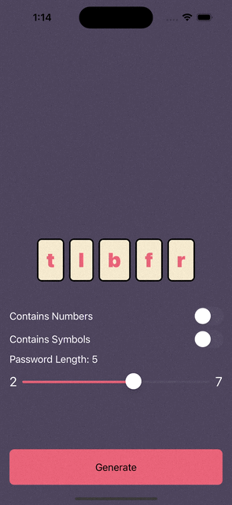
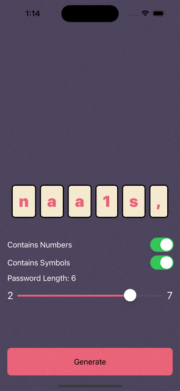
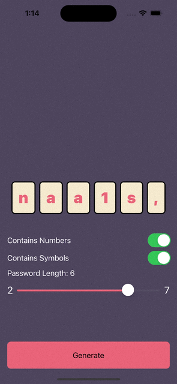

# Darwin Generator
An app do generate passwords based on Charles Darwin’s Origin of Species


| Generate | Select | Customize |
| --- | --- | --- |
|  |  |  |

### Architecture
This app was made in MVVM. The architecture follows the following Layers:
* UI (```PasswordGeneratorView```,```PasswordCharacterItem```
* ViewModel (```PasswordGeneratorViewModel```
* Service (```BookService```)

### External Tools
The only tool that was used was [Swiftlint](https://github.com/realm/SwiftLint), a tool to enforce Swift style and conventions.
Color pallete picked from [Colorhunt](https://colorhunt.co/palette/4d455de96479f5e9cf7db9b6)

### What would I have done if I had more time?
* Repository Layer: It's job is to know where to fetch information from: Cache or Backend, for example
* Better names for colors
* Custom Swiftlint rules
* Organize all rules for password generation in another Security Layer
* Fix bugs and current limitations

### Bugs and Limitations
* There's a current limit of 7 characters because of screen width. It was a challenge to present the password in a way that it was easily tappable and the user would know about this feature. If I had more time, I'd definitely tackle this as a priority
* There's a bug where if you tap the same character again, it won't work. it will require you to tap a second time.

### Feedback
This test was hard! It took me a lot of tries so I could deal with string indexes properly. I could've spent more time on organizing other things if, for example, the test asked me to show the first time that character appears in the book, instead of where specifically that character was picked from the book.
